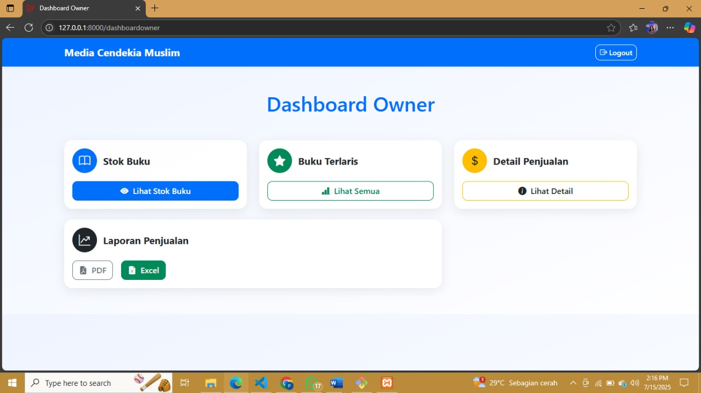

# 📚 Sistem Informasi Penjualan Buku - CV Media Cendekia

Sistem ini dibangun menggunakan Laravel 11 untuk mengelola proses penjualan buku secara online dengan peran multi-level user: **Pengguna (Pelanggan)**, **Admin**, dan **Owner**. Sistem ini mendukung pencarian buku menggunakan **algoritma Binary Search**, serta pengelolaan data buku, transaksi, laporan penjualan, dan notifikasi.

---

## 🔑 Fitur Utama Berdasarkan Role

### 👤 Pengguna / Pelanggan
- Registrasi dan Login
- Melihat katalog buku
- Pencarian buku berdasarkan kategori dan harga (binary search)
- Menambahkan buku ke keranjang
- Checkout dan melihat riwayat pembelian
- Notifikasi status pesanan

#### Tampilan Halaman Pelanggan


---

### 🧑‍💼 Admin
- Login Admin
- Dashboard informasi toko (total buku, kategori, penulis, pengarang, pengguna, dan penjualan)
- Manajemen data buku
- Manajemen kategori
- Manajemen penulis dan pengarang
- Melihat riwayat pembelian

#### Tampilan Halaman Admin


---

### 🧑‍💼 Owner
- Melihat stok buku
- Melihat data buku terlaris
- Melihat detail penjualan
- Mengekspor laporan penjualan ke PDF/Excel

#### Tampilan Halaman Owner


---

## 🛠️ Teknologi yang Digunakan
- Laravel 11
- PHP 8.x
- MySQL
- Tailwind CSS
- Blade Template Engine
- Git dan GitHub

---

## ⚙️ Instalasi dan Jalankan Project

```bash
git clone https://github.com/puttribakkaraa/Sistem-Informasi-Penjualan-Buku.git
cd Sistem-Informasi-Penjualan-Buku
composer install
cp .env.example .env
php artisan key:generate
# Atur konfigurasi DB di file .env
php artisan migrate --seed
php artisan serve
